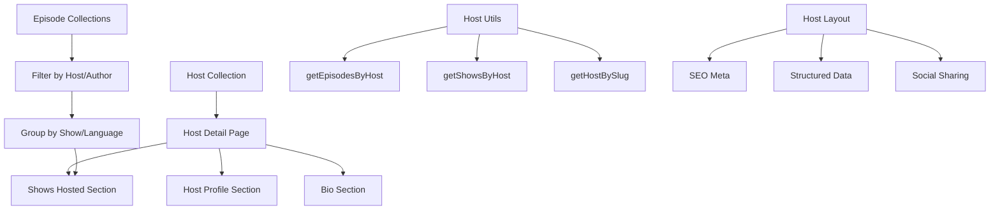

# Host Pages Architecture & Implementation Plan

## Overview

This plan outlines the implementation of dedicated host pages for the CRO.CAFE podcast website. Currently, guests have dedicated pages at `/guest/[slug].astro`, but hosts do not. This implementation will create similar pages for hosts that show their profile information, bio, and the shows they host (without individual episode widgets as requested).

## Current State Analysis

### Existing Infrastructure

- **Host Data**: Stored in `/src/content/hosts/` as JSON files (guido.json, michael.json, ricardo.json, yvonne.json)
- **Host Component**: `HostCard.astro` component exists for displaying host information
- **Guest Pattern**: Guests have pages at `/guest/[slug].astro` with profile info and episodes
- **Episode Data**: Episodes have `author` field (likely the host) and `guests` array

### Host Data Structure

```json
{
  "id": "guido",
  "name": "Guido X Jansen",
  "role": "Cognitive Psychologist & CRO Specialist",
  "bio": "As a cognitive psychologist and award-winning CRO specialist...",
  "image_url": "/images/hosts/guido.webp",
  "social_links": [
    {
      "platform": "linkedin",
      "url": "https://www.linkedin.com/in/gxjansen/"
    }
  ],
  "languages": ["en", "nl"],
  "type": "host"
}
```

## Architecture Overview



## Implementation Plan

### Phase 1: Core Infrastructure

#### 1.1 Create Host Utilities (`src/utils/hosts.ts`)

**Purpose**: Mirror the guest utilities but for hosts

**Functions to implement**:

```typescript
// Get host data by slug
export async function getHostBySlug(slug: string): Promise<HostEntry | undefined>;

// Find episodes where host is the author
export async function getEpisodesByHost(hostSlug: string): Promise<EpisodeEntry[]>;

// Get unique shows/languages the host appears in with episode counts
export async function getShowsByHost(hostSlug: string): Promise<ShowSummary[]>;

// Sort hosts alphabetically
export function sortHostsByName(hosts: HostEntry[]): HostEntry[];

// Get all hosts
export async function getAllHosts(): Promise<HostEntry[]>;
```

**Episode Association Logic**:

```typescript
// Find episodes by matching the author field
const hostEpisodes = episodes.filter(
  (episode) =>
    episode.data.attributes.author === host.name ||
    episode.data.attributes.author?.toLowerCase().includes(host.name.toLowerCase())
);
```

**Show Grouping Logic**:

```typescript
interface ShowSummary {
  language: string;
  showName: string;
  episodeCount: number;
  latestEpisode?: EpisodeEntry;
}

// Group episodes by language/show
const showsByHost = hostEpisodes.reduce((acc, episode) => {
  const language = getLanguageFromCollection(episode.collection);
  if (!acc[language]) {
    acc[language] = {
      language,
      showName: getShowNameByLanguage(language),
      episodeCount: 0,
      episodes: [],
    };
  }
  acc[language].episodeCount++;
  acc[language].episodes.push(episode);
  return acc;
}, {});
```

#### 1.2 Create Host Layout (`src/layouts/HostLayout.astro`)

**Purpose**: Dedicated layout for host pages with proper SEO

**Features**:

- Meta tags with host information
- Open Graph tags for social sharing
- Structured data (JSON-LD) for host profiles
- Canonical URLs
- Language-specific meta descriptions

**SEO Implementation**:

```typescript
// Meta tags
const title = `${host.name} - ${host.role} | CRO.CAFE Host`;
const description = `Learn about ${host.name}, ${
  host.role
} and host of CRO.CAFE podcast. ${host.bio.substring(0, 150)}...`;

// Structured data
const structuredData = {
  '@context': 'https://schema.org',
  '@type': 'Person',
  name: host.name,
  jobTitle: host.role,
  description: host.bio,
  image: host.image_url,
  sameAs: host.social_links.map((link) => link.url),
  worksFor: {
    '@type': 'Organization',
    name: 'CRO.CAFE',
  },
};
```

#### 1.3 Update Content Schema (`src/content/config.ts`)

**Purpose**: Ensure host collection is properly typed

**Validation**: Verify existing Zod schema for host data structure is complete

### Phase 2: Host Detail Pages

#### 2.1 Create Host Detail Page (`src/pages/host/[slug].astro`)

**URL Structure**: `/host/[slug]` (language-agnostic like guests)

**Static Generation**:

```typescript
export async function getStaticPaths() {
  const hosts = await getCollection('hosts');

  return hosts.map((host) => ({
    params: { slug: host.id },
    props: {
      host,
      shows: await getShowsByHost(host.id),
    },
  }));
}
```

**Page Structure**:

1. **Navigation**: Back to hosts overview
2. **Host Profile**: Name, role, bio, profile image, social links
3. **Shows Hosted**: List of shows/languages with episode counts
4. **Bio Section**: Extended biography information

#### 2.2 Host Profile Section

**Design**: Similar to guest pages but adapted for hosts

**Components**:

- **Profile Image**: Optimized using existing image utilities
- **Basic Info**: Name, role, languages hosted
- **Social Links**: Twitter, LinkedIn with proper accessibility
- **Bio**: Full biography text

**Implementation**:

```astro
<!-- Host profile -->
<div class="bg-white dark:bg-gray-800 rounded-lg shadow-lg overflow-hidden">
  <div class="p-8">
    <div class="flex flex-col md:flex-row gap-8">
      <!-- Host image -->
      <div class="flex-shrink-0">
        
      </div>

      <!-- Host info -->
      <div class="flex-grow text-center md:text-left">
        <h1 class="text-3xl font-bold text-gray-900 dark:text-white mb-2">{name}</h1>
        <p class="text-xl text-gray-600 dark:text-gray-400 mb-2">{role}</p>
        <p class="text-lg text-gray-600 dark:text-gray-400 mb-4">
          Hosts: {languages.map(lang => getShowNameByLanguage(lang)).join(', ')}
        </p>

        <!-- Social links -->
        {social_links && social_links.length > 0 && (
          <div class="flex gap-4 justify-center md:justify-start mb-6">
            <!-- Social link components -->
          </div>
        )}
      </div>
    </div>
  </div>
</div>
```

#### 2.3 Shows Hosted Section

**Purpose**: Show the shows/languages this host appears in (NO individual episode widgets)

**Display**: Cards showing:

- Language/show name
- Number of episodes hosted
- Link to that language's episode overview
- Latest episode date

**Implementation**:

```astro
<!-- Shows hosted -->
{shows && shows.length > 0 && (
  <div class="mt-8 pt-8 border-t border-gray-200 dark:border-gray-700">
    <h2 class="text-xl font-semibold text-gray-900 dark:text-white mb-4">
      Shows hosted by {name}
    </h2>
    <div class="grid gap-4 md:grid-cols-2">
      {shows.map((show) => (
        <div class="bg-gray-50 dark:bg-gray-700 rounded-lg p-4">
          <a
            href={`/${show.language}/episodes`}
            class="block hover:text-accent transition-colors"
          >
            <h3 class="font-medium text-gray-900 dark:text-white mb-2">
              {show.showName}
            </h3>
            <p class="text-sm text-gray-600 dark:text-gray-400">
              {show.episodeCount} episodes hosted
            </p>
            {show.latestEpisode && (
              <p class="text-xs text-gray-500 dark:text-gray-500 mt-1">
                Latest: {show.latestEpisode.data.attributes.formatted_published_at}
              </p>
            )}
          </a>
        </div>
      ))}
    </div>
  </div>
)}
```

### Phase 3: Integration & Navigation

#### 3.1 Host Overview Page (`src/pages/hosts/index.astro`)

**Purpose**: Landing page showing all hosts

**Features**:

- Grid of host cards
- Option to filter by language/show
- SEO optimized
- Responsive design

**Implementation**:

```astro
---
import Layout from '../../layouts/Layout.astro';
import HostCard from '../../components/host/HostCard.astro';
import { getAllHosts, sortHostsByName } from '../../utils/hosts';

const hosts = sortHostsByName(await getAllHosts());
---

<Layout title="Podcast Hosts | CRO.CAFE" description="Meet the hosts of CRO.CAFE podcast">
  <main class="container mx-auto px-4 py-8">
    <h1 class="text-3xl font-bold text-gray-900 dark:text-white mb-8">
      Meet Our Hosts
    </h1>

    <div class="grid gap-6 md:grid-cols-2 lg:grid-cols-3">
      {hosts.map((host) => (
        <a href={`/host/${host.id}`} class="block">
          <HostCard host={host.data} showBio={true} />
        </a>
      ))}
    </div>
  </main>
</Layout>
```

#### 3.2 Navigation Updates

**Header**: Add "Hosts" link to main navigation
**Episode Pages**: Link host names to their detail pages
**Cross-linking**: Ensure hosts are linked from relevant pages

#### 3.3 Host Cards Enhancement

**Update**: Enhance existing `HostCard.astro` component
**Features**:

- Make cards clickable to host detail pages
- Display number of shows/episodes hosted
- Improved hover states

### Phase 4: SEO & Performance

#### 4.1 SEO Optimization

**Meta Tags**: Unique titles and descriptions for each host
**Structured Data**: Person schema with host information
**Canonical URLs**: Proper canonical tags
**Sitemap**: Include host pages in sitemap generation

#### 4.2 Performance Optimization

**Images**: Optimize host images using Astro's Image component
**Lazy Loading**: Implement for host cards and images
**Caching**: Ensure proper caching headers

#### 4.3 Accessibility

**ARIA Labels**: Proper labeling for all interactive elements
**Focus Management**: Keyboard navigation support
**Screen Readers**: Semantic HTML and proper headings
**Color Contrast**: Ensure WCAG 2.1 AA compliance

## URL Structure

### Host Pages

- **Host Detail**: `/host/guido`, `/host/michael`, `/host/ricardo`, `/host/yvonne`
- **Host Overview**: `/hosts`
- **Consistency**: Matches guest URL pattern (`/guest/[slug]`)

### Navigation Flow

```
Homepage → Hosts Overview (/hosts) → Individual Host (/host/[slug]) → Show Episodes (/[lang]/episodes)
```

## Data Flow

### Host-Episode Association

1. Load all episodes across all languages
2. Filter episodes where `author` field matches host name
3. Group by language/show
4. Count episodes per show
5. Display show summaries (not individual episodes)

### Show Summary Generation

```typescript
interface ShowSummary {
  language: string;
  showName: string;
  episodeCount: number;
  latestEpisode?: EpisodeEntry;
}
```

## Testing Strategy

### Unit Tests

- Host utility functions (`getHostBySlug`, `getEpisodesByHost`, `getShowsByHost`)
- Data transformation logic
- Component rendering

### Integration Tests

- Host page generation for all hosts
- Episode association logic accuracy
- Navigation flow between pages

### E2E Tests

- Host page navigation from overview to detail
- Cross-linking functionality (episodes → hosts → shows)
- Mobile responsiveness
- Accessibility compliance

## Validation Criteria

### Phase 1 Completion Checklist

- [ ] `src/utils/hosts.ts` created with all required functions
- [ ] `src/layouts/HostLayout.astro` created with proper SEO
- [ ] Content schema updated and validated
- [ ] Unit tests written and passing

### Phase 2 Completion Checklist

- [ ] `/src/pages/host/[slug].astro` generates correctly for all 4 hosts
- [ ] Profile sections display all host information correctly
- [ ] Shows hosted section shows correct data (no individual episodes)
- [ ] Navigation works properly (back to hosts, links to shows)
- [ ] Images optimized and loading correctly

### Phase 3 Completion Checklist

- [ ] `/src/pages/hosts/index.astro` functional and styled
- [ ] Navigation updated across site (header, episode pages)
- [ ] Host cards enhanced and properly linked
- [ ] Cross-linking working (episodes link to hosts)

### Phase 4 Completion Checklist

- [ ] SEO meta tags and structured data implemented
- [ ] Performance optimized (Lighthouse scores 95+)
- [ ] Accessibility compliance verified (WCAG 2.1 AA)
- [ ] All tests passing (unit, integration, e2e)
- [ ] Sitemap includes host pages

## Technical Considerations

### Multi-language Hosts

- Some hosts (like Guido) host shows in multiple languages
- Show both languages in their profile
- Link to appropriate language-specific episode overviews

### Episode Author Matching

- Episodes have `author` field that should match host names
- Implement fuzzy matching for variations in naming
- Handle cases where author field might be formatted differently

### Performance

- Static generation for all host pages
- Optimized images using Astro's built-in optimization
- Minimal JavaScript for interactivity

### Accessibility

- Semantic HTML structure
- Proper heading hierarchy
- Keyboard navigation support
- Screen reader compatibility
- High contrast ratios

## Future Enhancements

### Phase 5 (Optional)

- Host statistics (total episodes, years hosting, etc.)
- Host collaboration tracking (episodes with multiple hosts)
- Advanced filtering on hosts overview page
- Host RSS feeds or dedicated show feeds

This plan provides a comprehensive approach to implementing host pages that mirror the existing guest page functionality while respecting the specific requirements (no individual episode widgets, focus on shows hosted).
