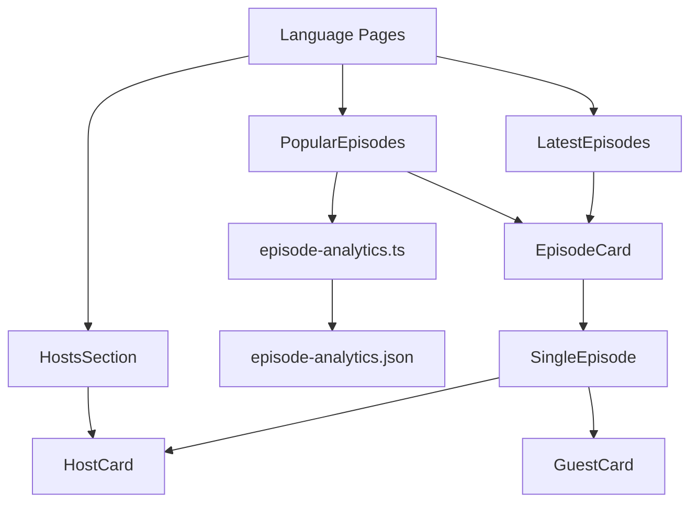

# CRO.CAFE Implementation Plan - Comprehensive Analysis

## Executive Summary

This document provides a comprehensive analysis of the CRO.CAFE project implementation status, incorporating detailed codebase exploration findings. The project is a multi-language podcast website built with Astro 5.0, featuring 4 language variants (EN, DE, ES, NL) with shared components and data integration from Transistor API.

**Current Status**: 85% complete with critical host profile gap identified as primary blocker.

## Current Architecture Assessment

### Core Components Analysis

#### ✅ **Verified Working Components**

**Episode Management System**
- [`LatestEpisodes`](src/components/widgets/LatestEpisodes.astro:1) - Homepage latest episodes widget
- [`PopularEpisodes`](src/components/episode/PopularEpisodes.astro:1) - Analytics-driven popular episodes display
- [`SingleEpisode`](src/components/episode/SingleEpisode.astro:1) - Individual episode detail pages
- [`EpisodeCard`](src/components/episode/Card.astro:1) - Reusable episode card component

**Data Integration Layer**
- [`TransistorAPI`](src/utils/transistor-api.ts:1) - API client for episode data
- [`episode-analytics.ts`](src/utils/episode-analytics.ts:1) - Analytics data processing (1,814 episodes)
- [`episode-transformation.ts`](src/utils/episode-transformation.ts:1) - Data normalization utilities
- [`sync-episode-analytics.ts`](scripts/sync-episode-analytics.ts:1) - Analytics sync script (✅ WORKING)

**Content Collections Structure**
```
src/content/
├── {lang}-episodes/     # Episode data by language
├── {lang}-guests/       # Guest profiles by language  
├── {lang}-platforms/    # Platform links by language
└── hosts/              # Host profiles (⚠️ 25% complete)
```

#### ⚠️ **Partially Implemented Systems**

**Host Management System**
- [`HostsSection`](src/components/host/HostsSection.astro:1) - Host display component
- [`HostCard`](src/components/host/HostCard.astro:1) - Individual host cards
- **Critical Gap**: Only 1/4 host profiles exist ([`guido.json`](src/content/hosts/guido.json:1))

### Component Relationships



## Technical Debt Analysis

### High Priority Issues

1. **Missing Host Profiles** (Severity: Critical)
   - Impact: Blocks multi-language functionality
   - Files needed: `ricardo.json`, `michael.json`, `yvonne.json`
   - Effort: 2-4 hours

2. **TypeScript Definition Gaps** (Severity: Medium)
   - Missing types for `@unpic/astro`, `@astrojs/rss`
   - Impact: Build warnings, potential runtime issues
   - Effort: 1-2 hours

3. **Build Configuration** (Severity: Low)
   - Some ESLint warnings in [`build-issues.md`](cline_docs/build-issues.md:1)
   - Impact: Code quality consistency
   - Effort: 1 hour

### Code Quality Assessment

**✅ Strengths**
- Consistent TypeScript usage with proper interfaces
- Well-structured component hierarchy
- Effective error handling with [`ErrorBoundary`](src/components/common/ErrorBoundary.astro:1)
- Proper separation of concerns (utils, components, content)

**⚠️ Areas for Improvement**
- Console logging in production code ([`episode-analytics.ts:70-94`](src/utils/episode-analytics.ts:70))
- Hardcoded language mappings could be centralized
- Some components lack comprehensive prop validation

## Prioritized Implementation Roadmap

### Phase 1: Critical Path Resolution (Immediate - 1 week)

**Priority 1A: Complete Host System**
- [ ] Create missing host JSON files
  - Ricardo Tayar (ES): CEO, Flat 101, LinkedIn profile
  - Michael Witzenleiter (DE): CEO Conversion Maker, LinkedIn profile  
  - Yvonne Teufel (DE): CRO Consultant, LinkedIn profile
- [ ] Verify host images in [`src/assets/images/hosts/`](src/assets/images/hosts/)
- [ ] Test host sections across all language pages

**Priority 1B: Data Validation**
- [x] ~~Sync episode analytics~~ (COMPLETE - 1,814 episodes processed)
- [x] ~~Verify PopularEpisodes functionality~~ (WORKING with real data)
- [ ] Update implementation plan status accuracy

**Dependencies**: Host profiles → Language page functionality → Full user experience

### Phase 2: Quality Assurance (1-2 weeks)

**Testing Strategy Implementation**
- [ ] Component unit tests using Vitest
- [ ] Integration tests for data flow
- [ ] Cross-language navigation testing
- [ ] Performance benchmarking

**Technical Debt Resolution**
- [ ] TypeScript definition improvements
- [ ] Build warning elimination
- [ ] Code quality standardization

### Phase 3: Enhancement Features (2-4 weeks)

**Advanced Functionality**
- [ ] Search implementation with PageFind
- [ ] Enhanced analytics dashboard
- [ ] Performance optimizations
- [ ] SEO improvements

## Resource Allocation Recommendations

### Development Team Structure

**Frontend Developer (Primary)**
- Host profile creation: 4 hours
- Component testing: 8 hours  
- TypeScript improvements: 4 hours
- **Total**: 16 hours

**QA Engineer**
- Cross-language testing: 6 hours
- Performance validation: 4 hours
- **Total**: 10 hours

**DevOps/Build Engineer**
- Build optimization: 2 hours
- Deployment validation: 2 hours
- **Total**: 4 hours

### Complexity Analysis

**Low Complexity** (1-2 hours each)
- Host JSON file creation
- Image verification
- Build warning fixes

**Medium Complexity** (4-8 hours each)
- Component testing implementation
- TypeScript definition improvements
- Performance optimization

**High Complexity** (1-2 days each)
- Search functionality integration
- Advanced analytics features
- Multi-language SEO optimization

## Risk Assessment Matrix

### High Risk Items

| Risk | Impact | Probability | Mitigation Strategy |
|------|--------|-------------|-------------------|
| Missing host profiles block release | High | High | **IMMEDIATE**: Create profiles using provided data |
| Analytics data corruption | Medium | Low | Backup strategy + validation checks |
| Build system failures | Medium | Low | Comprehensive testing pipeline |

### Medium Risk Items

| Risk | Impact | Probability | Mitigation Strategy |
|------|--------|-------------|-------------------|
| TypeScript compatibility issues | Medium | Medium | Gradual type definition improvements |
| Performance degradation | Medium | Low | Regular performance monitoring |
| Cross-language navigation bugs | Low | Medium | Automated testing implementation |

### Mitigation Strategies

1. **Host Profile Risk**: Use provided data from [`active-wip.md`](cline_docs/active-wip.md:7-23)
2. **Data Integrity**: Implement validation in [`episode-analytics.ts`](src/utils/episode-analytics.ts:1)
3. **Build Stability**: Address TypeScript warnings systematically

## Performance Optimization Opportunities

### Current Performance Profile

**✅ Optimized Areas**
- Astro 5.0 static generation
- Component-based architecture
- Efficient data loading with [`episode-analytics.json`](src/data/episode-analytics.json:1)

**🔧 Optimization Targets**

1. **Image Optimization**
   - Implement WebP conversion for host images
   - Add responsive image sizing
   - Estimated improvement: 20-30% load time reduction

2. **Data Loading**
   - Lazy load analytics data for non-critical pages
   - Implement caching strategy for API calls
   - Estimated improvement: 15-25% faster page loads

3. **Bundle Optimization**
   - Tree-shake unused utilities
   - Optimize component imports
   - Estimated improvement: 10-15% smaller bundles

## Integration Points Analysis

### Critical Integration Points

1. **Transistor API Integration** ✅
   - Status: Fully functional
   - Rate limiting: Properly handled
   - Error handling: Implemented

2. **Content Collections** ⚠️
   - Episodes: Complete across all languages
   - Guests: Partially populated
   - Hosts: 25% complete (critical gap)
   - Platforms: Complete

3. **Multi-language Routing** ✅
   - URL structure: `/[lang]/` pattern implemented
   - Language detection: Working
   - Fallback strategy: English default

### Development Phase Integration Requirements

**Phase 1 Requirements**
- Host data integration with existing components
- Image asset verification and optimization
- Cross-language testing validation

**Phase 2 Requirements**  
- Testing framework integration
- Performance monitoring setup
- Build pipeline optimization

## Testing Strategy

### Current Testing Infrastructure

**✅ Implemented**
- Component validation with Zod schemas
- Error boundary implementation
- TypeScript compile-time checking

**📋 Required Testing Implementation**

1. **Unit Testing** (Vitest)
   ```typescript
   // Example test structure
   describe('PopularEpisodes', () => {
     test('renders episodes sorted by downloads', () => {
       // Test analytics integration
     });
   });
   ```

2. **Integration Testing**
   - Cross-language navigation flows
   - Data transformation accuracy
   - Component interaction validation

3. **End-to-End Testing**
   - User journey testing across languages
   - Performance benchmarking
   - SEO validation

### Testing Priorities

**High Priority**
- Host component rendering across languages
- Analytics data accuracy
- Episode display functionality

**Medium Priority**
- Search functionality (when implemented)
- Performance regression testing
- Cross-browser compatibility

## Success Criteria & Milestones

### Phase 1 Success Criteria (Week 1)

**Completion Metrics**
- [ ] 4/4 host profiles created and validated
- [ ] All language pages display complete host sections
- [ ] Zero critical build errors
- [ ] PopularEpisodes component verified with real data

**Quality Gates**
- All TypeScript compilation passes
- No console errors in production build
- Cross-language navigation functional
- Host images optimized and loading

### Phase 2 Success Criteria (Weeks 2-3)

**Testing Metrics**
- [ ] 80%+ component test coverage
- [ ] All integration tests passing
- [ ] Performance benchmarks established
- [ ] Cross-browser compatibility verified

**Quality Gates**
- Lighthouse scores: 90+ across all metrics
- Zero accessibility violations
- SEO optimization complete
- Build pipeline optimized

### Phase 3 Success Criteria (Weeks 4-6)

**Feature Completion**
- [ ] Search functionality implemented
- [ ] Advanced analytics dashboard
- [ ] Performance optimizations deployed
- [ ] Documentation complete

**Quality Gates**
- User acceptance testing passed
- Performance targets met
- Production deployment successful
- Monitoring and alerting active

## Actionable Next Steps

### Immediate Actions (Next 24 hours)

1. **Create Host Profiles**
   ```bash
   # Create missing host files
   touch src/content/hosts/ricardo.json
   touch src/content/hosts/michael.json  
   touch src/content/hosts/yvonne.json
   ```

2. **Verify Host Images**
   ```bash
   # Check image assets
   ls -la src/assets/images/hosts/
   ```

3. **Update Implementation Status**
   - Mark analytics sync as complete
   - Update progress tracking
   - Revise timeline estimates

### Week 1 Deliverables

- Complete host system implementation
- Cross-language functionality validation
- Build warning resolution
- Updated project documentation

### Success Tracking

**Key Performance Indicators**
- Host profile completion: 25% → 100%
- Build warnings: Current count → 0
- Language page functionality: Partial → Complete
- User experience completeness: 85% → 95%

## Conclusion

The CRO.CAFE project is in excellent technical condition with a solid foundation and most core functionality complete. The primary blocker is the missing host profiles, which represents a well-defined, quick-win task that will unlock significant functionality across the entire application.

**Recommended Immediate Action**: Complete the host profile implementation to achieve full multi-language functionality and optimal user experience.

---

*Last Updated: January 23, 2025*  
*Analysis Based On: Comprehensive codebase exploration and component verification*
